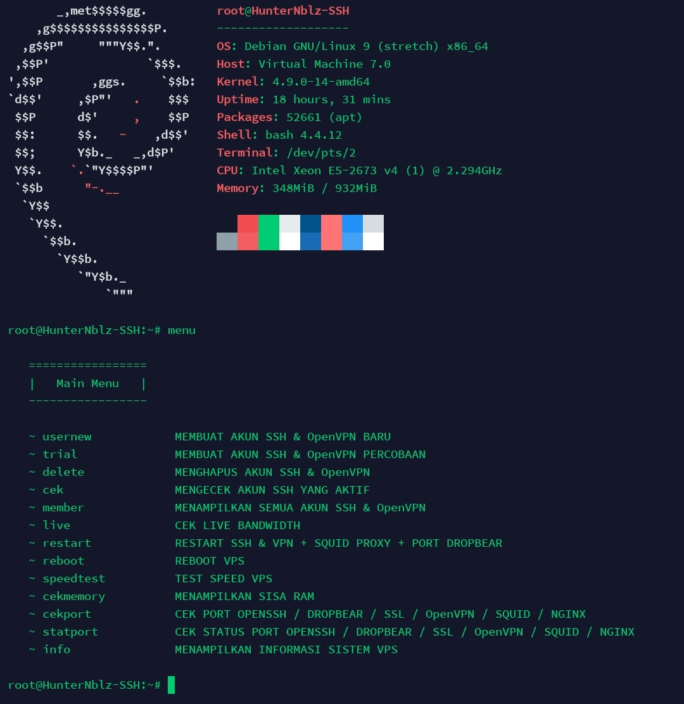

<H1 align="center">
SSH Installer
</H1>

<p align="center">
  <br>
  
</p>

## Usage

```terminal
$ apt update
$ apt upgrade -y
$ apt-get install git -y
$ git clone https://github.com/hunternblz/ssh-installer
$ cd ssh-installer
$ chmod +x install.sh
$ ./install.sh
```

## OS
* Debian 9
